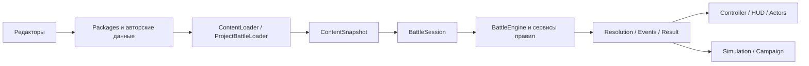

# a_star: исправления и повторное ревью кода и архитектуры

Дата: 2026-10-05. Проект: `Z:/Godot/Projects/a_star`. Основа сравнения: HEAD `0aa0930` и изменения рабочего дерева, впоследствии закоммиченные как `64d2d65`. Исправления следующего прохода ревью описаны в [STATUS.md](../architecture/STATUS.md). Авторские характеристики, изображения и сохранённые бои не редактировались.

## Результат

Исправлены подтверждённые дефекты из предыдущего ревью и согласованные с кодом замечания другой модели. Добавлены регрессионные проверки, актуализированы существующие smoke-тесты. **627 проверок проходят; ошибок выполнения, FAIL и сообщений об утечках в итоговом запуске тестов нет.** Отдельно компилируются все 177 GDScript в `features/` и `tools/`.

Повторное ревью не выявило нового подтверждённого блокирующего дефекта в штатном старте и проверенных командах боя. Остаются риски в модели кампаний, контракте расширений и неподдерживаемых полях авторинга. Они перечислены отдельно ниже; прохождение тестов не означает отсутствие всех возможных ошибок.

Проверены ядро боя, геометрия/пути, способности, статусы и реакции гексов, session/AI, загрузка и изоляция контента, сериализация, графический контроллер/HUD/акторы, редактор боя, запуск игры, симуляция, переходы кампании и экспорт. Ручной полный бой, оконные диалоги и визуальная читаемость при двух разрешениях в эту проверку не входят.

## Исправленные дефекты

### 1. Потеря черновика и восстановление редактора

Открытие другого боя и закрытие приложения проверяют отличия от последней успешно открытой/сохранённой версии. Подтверждение появляется перед заменой; отмена выбора файла не уничтожает черновик. Успешная запись обновляет сохранённую версию. Проверка сравнивает документ, поэтому undo к сохранённому состоянию тоже снимает признак изменений.

Восстановление после ошибки библиотеки больше не проходит через недостижимый вызов заполнения сторон. При отсутствии документа читается настроенный стартовый бой, а не случайный debug-бой; обновляются стороны, профили ИИ и путь. При существующем документе обновление библиотеки его сохраняет.

Кисть препятствия и свойства гекса отклоняют блокирование занятой клетки. Валидатор отдельно запрещает старт живого участника на непроходимой клетке.

Код: [battle_editor_shell.gd](Z:/Godot/Projects/a_star/tools/battles/battle_editor_shell.gd), [battle_authoring_validator.gd](Z:/Godot/Projects/a_star/features/battle/definitions/battle_authoring_validator.gd).

Проверки: грязный/чистый документ, подтверждение действия, восстановление настроенного документа и сторон, невозможность блокировать занятую клетку; отдельный smoke проверяет edit/undo/redo, add/remove, координаты и две записи документа.

### 2. Распространение состояний и порядок обработки области

Новая вода рядом с уже наэлектризованной водой раньше могла остаться водой: распространение запускалось только от новой клетки. Теперь проверяются также существующие соседи.

Раньше площадное создание состояний распространялось после каждой клетки. Промежуточное составное состояние могло изменить соседнюю клетку до обработки её собственного эффекта. Теперь весь эффект `core:hex_state` собирается в один пакет, применяется на копии карты и только затем распространяется. Порядок разных эффектов способности сохраняется; порядок перечня клеток одной области больше не меняет результат проверенного сценария огонь + электричество.

После commit взрывы исполняются отдельно, затем каждый затронутый участник получает одно воздействие итогового состояния. Недопустимый элемент пакета не меняет карту, здоровье или ревизии.

Код: [ability_executor.gd](Z:/Godot/Projects/a_star/features/abilities/ability_executor.gd), [map_mutation_service.gd](Z:/Godot/Projects/a_star/features/battle/engine/map_mutation_service.gd), [hex_state_service.gd](Z:/Godot/Projects/a_star/features/battle/engine/hex_state_service.gd).

Проверки: существующий составной сосед, обратный порядок клеток/мутаций, атомарный отказ всего пакета, запрещённое удаление/блокирование занятого гекса, однократное воздействие и отсутствие повторного воздействия при неизменном состоянии.

### 3. ИИ и управление призванными

HEX-умение радиуса 0 теперь формирует команду с целью-гексом. Проверяется не только тип команды: движок действительно принимает сформированную ИИ команду.

Опасность перемещения считается на отдельной копии юнита теми же правилами статусов и гексов, что использует исполнение. Учитываются усиление электричества влагой, поглощение, иммунитеты статусов, замедление маслом, гибель и паралич. Удалена оставшаяся проверка старого «сырого» урона, которая могла отвергать маршрут даже после безопасного нового прогноза.

Призванный юнит наследует сторону и только настоящее индивидуальное переопределение управления. Если управление задано стороной, последующая смена её источника команд распространяется и на призванного.

Отсутствующая/отклонённая команда ИИ и лимит автоматических действий больше не превращаются в молчаливую остановку: контроллер блокирует исполнение и публикует явную ошибку. Повторный запуск автоматического цикла защищён от наложения на уже работающий цикл.

Код: [ai_command_source.gd](Z:/Godot/Projects/a_star/features/battle/session/ai_command_source.gd), [movement_impact_forecast.gd](Z:/Godot/Projects/a_star/features/battle/engine/movement_impact_forecast.gd), [enemy_brain.gd](Z:/Godot/Projects/a_star/features/battle/engine/enemy_brain.gd), [battle_session.gd](Z:/Godot/Projects/a_star/features/battle/session/battle_session.gd).

Проверки: HEX-команда, смертельное электричество при влаге, сокращённый маслом путь, безопасное пересечение огня при влаге/иммунитете, отсутствие мутаций настоящего юнита прогнозом, создание турели и смена управления её стороной.

### 4. Ошибки после изменения состояния и восстановление отображения

Остановка после уже применённых эффектов завершения хода сохраняет события и принятую ревизию через `terminal_error`; она не выдаётся за обычную отклонённую команду без последствий. После terminal error движок запрещает дальнейшие команды и внешние мутации. Симуляция тоже завершает такой прогон ошибкой.

Неуспех presentation теперь приводит к полному восстановлению карты и юнитов из сессии, включая ОЗ, статусы и тела. Определения призванных сохраняются до показа, чтобы сбой более раннего события не лишил восстановление данных призыва. Восстановление погибшего актора не создаёт отменённый Tween с оставленным временным аниматором.

Публичная мутация через контроллер запрещена во время инициализации, показа и аварийной остановки. `battle_failed`/`battle_finished` выдаются один раз; завершение боя не публикуется после ошибки runtime. Игровой launcher и пробный бой редактора владеют своим сообщением об ошибке, поэтому второй экран с тем же сообщением не появляется.

Код: [battle_engine.gd](Z:/Godot/Projects/a_star/features/battle/engine/battle_engine.gd), [battle_controller.gd](Z:/Godot/Projects/a_star/features/battle/controller/battle_controller.gd), [battle_unit_view_registry.gd](Z:/Godot/Projects/a_star/features/battle/view/battle_unit_view_registry.gd), [unit_actor.gd](Z:/Godot/Projects/a_star/features/battle/units/unit_actor.gd).

Проверки: terminal guard движка, запрет конкурентной мутации, инъекция terminal failure, восстановление полного множества визуальных клеток и однократное сообщение об ошибке. Все разновидности сбоев Tween/оконной среды отдельно не воспроизводились.

### 5. Валидация и изоляция контента

BattleDocument проверяет схему, ID, совпадение map ID и полную допустимость боя: цель, фракции, стороны, расстановку и определения. Неподдерживаемая фракция не проходит как произвольное число. Все определения боёв и manifest entry points проверяются загрузчиком пакетов; межпакетные ссылки требуют объявленных зависимостей.

Snapshot копирует входящие определения и выдаёт отдельные копии, включая вложенные характеристики. Активные умения runtime тоже копируются. ContentLock выдаётся отдельно; изменение его внешней копии не меняет идентичность снимка. ModAPI фиксирует реестр обработчиков. Preview создаёт новый снимок с переопределениями вместо порчи кешированного ресурса. Session выдаёт отдельную копию setup, включая стороны, spawns и вложенные определения. Prepared session проверяется также по исходному snapshot, а не только по ID и seed.

Fingerprint теперь учитывает сохранённые характеристики и параметры эффектов. Изменение ОЗ при прежних ID/версии изменяет SHA-256. Это хеш структуры контента, а не байтов внешних изображений/сцен.

Отсутствующая необязательная картинка не блокирует логический запуск; графическая сторона получает warning/fallback. Режим загрузки без авторской presentation пропускает её построение. Выход имени картинки из assets запрещён. Ближняя атака с дальностью 1 больше не отклоняется общим ограничением для дальнего боя.

Код: [content_snapshot.gd](Z:/Godot/Projects/a_star/features/battle/definitions/content_snapshot.gd), [content_loader.gd](Z:/Godot/Projects/a_star/features/content/content_loader.gd), [content_reference_validator.gd](Z:/Godot/Projects/a_star/features/content/content_reference_validator.gd), [battle_document.gd](Z:/Godot/Projects/a_star/features/content/battles/battle_document.gd), [unit_library.gd](Z:/Godot/Projects/a_star/features/content/units/unit_library.gd).

Проверки: вложенные копии, ContentLock, замороженный реестр, hash при изменении характеристики, undeclared/declared dependency, несовпадающий map ID, отсутствующая цель, непроходимый spawn, неверная фракция, дробная координата, сериализация/запись/чтение, отсутствующая картинка и запрещённое имя, конфликт типов обычной атаки.

### 6. HUD, ввод, движение и экспорт

HUD цели показывает её реальные статусы с уровнями. Скорость можно менять во время анимации; NaN/INF/неположительная скорость отклоняются. Периодический урон содержит `source_status_id`, поэтому горение больше не выдаётся за урон клетки огня.

Клик рассчитывает координаты из самого события и работает без предшествующего hover. Escape возвращает выбор движения. Маршрут анимации хранится в координатах родителя актора: изменение масштаба/позиции поля не отрывает юнита от пути.

Для непроходимости, отличающейся поверхности и стоимости добавлены маркеры. Обновление клетки перестраивает только её маркер. Это техническое отображение свойств; визуальная приёмка новых маркеров в обычном окне остаётся отдельной проверкой.

Экспорт исключает инструменты, тесты, docs, прежние build, ручные preview и debug launchers. `build/.gdignore` предотвращает импорт результатов предыдущей сборки. Авторские данные остаются включёнными.

Код: [battle_hud.gd](Z:/Godot/Projects/a_star/features/battle/view/battle_hud.gd), [battle_input_router.gd](Z:/Godot/Projects/a_star/features/battle/view/battle_input_router.gd), [unit_movement_animator.gd](Z:/Godot/Projects/a_star/features/battle/view/unit_movement_animator.gd), [battle_map_view.gd](Z:/Godot/Projects/a_star/features/battle/view/battle_map_view.gd), [export_presets.cfg](Z:/Godot/Projects/a_star/export_presets.cfg).

## Тесты и границы доказательств

| Проверка | Результат |
| --- | --- |
| Обновлённый battle smoke | 93 проверки, проходит |
| Обновлённый editor smoke | 17 проверок, проходит |
| Новые регрессии | 517 проверок, проходит |
| Компиляция features/tools | 177 GDScript, 0 ошибок |
| Детерминированные маршруты | 30 seed: геометрия, связность, стоимость и бюджет всех достижимых путей |
| Авторский headless-бой | Завершается; два прогона одного seed имеют одинаковый статус/число команд/раундов |
| Headless-кампания ember_pack | Завершается, 2 сценария/2 боя |
| Старт игры, debug, 3 редактора и 2 preview | Короткие headless-запуски без ошибок |
| Игровой PCK | Собирается и запускается из временной папки отдельно от исходного проекта |
| Git diff | Проверен на ошибки whitespace; изменения остаются в рабочем дереве |

Основной запуск: [run_tests.py](Z:/Godot/Projects/a_star/tools/tests/run_tests.py). Runner проверяет не только код процесса, но и успешный итог, минимальное число проверок и отсутствие ошибок в журнале. Ошибка GDScript не может быть скрыта успешным выходом или частичным счётчиком. Журналы сохраняются в системной временной папке. Тестовые JSON используют уникальные имена по PID и удаляются после успешного чтения.

```powershell
python tools/tests/run_tests.py --godot Z:/Godot/Godot_v4.7-stable_win64_console.exe
Z:/Godot/Godot_v4.7-stable_win64_console.exe --headless --path . --script tools/tests/check_scripts.gd
```

Старый smoke содержал ожидания прежних статусов/передачи хода и зависел от конкретной авторской сцены и старой структуры HUD. Правила проверяются фиксированным core-fixture; текущие интерфейсные контракты и сценарии исправлений — новой suite. Это не перенос прежних неверных ожиданий в игровой код.

Прямая отдельная компиляция некоторых связанных классов через `--check-only --script` выдавала сообщения о оставшихся GDScript-ресурсах при завершении Godot. Проверка через штатные composition roots компилирует все 177 файлов без этих сообщений; итоговый строгий runner тоже чистый. Это не скрытые диагностические ошибки тестов.

Тесты не доказывают визуальную читаемость, оконный focus, фактическую работу FileDialog, полный ручной бой, отмену анимации при уничтожении окна, поведение на всех размерах карт и произвольных сторонних обработчиках. Сравнение seed проверяет итоговые показатели; побайтового replay журнала событий пока нет. EXE с шаблонами экспорта не собирался: проверен PCK под той же версией Godot.

## Новые находки и остающиеся риски повторного ревью

### R1. P2: кампании проверяются недостаточно строго

**Статически подтверждено.** [ContentLoader._validate_scenarios](Z:/Godot/Projects/a_star/features/content/content_loader.gd:397) проверяет существование сценариев и целей перехода. Он не запрещает два перехода одного исхода и не требует, чтобы entry/цели принадлежали `campaign.scenario_ids`.

Два перехода VICTORY допустимы загрузчику; [CampaignSession](Z:/Godot/Projects/a_star/features/campaign/campaign_session.gd:75) берёт первый. Результат зависит от порядка авторского массива. Ссылка на существующий сценарий вне списка кампании также проходит, а [лимит runner](Z:/Godot/Projects/a_star/features/campaign/campaign_simulation_runner.gd:25) вычисляется по этому списку и может остановить допустимый фактически граф слишком рано.

Штатная кампания прошла прогон; проблема касается новых/неправильно составленных кампаний. Рекомендация: единый валидатор кампании — уникальность ID/исходов, членство entry и переходов, допустимость enum, явная политика циклов и их лимита. Добавить отрицательные сценарии для этих случаев.

### R2. P2: старый результат можно принять за новый бой того же ID

**Статически подтверждено при повторном использовании battle ID в разных сценариях.** [CampaignSession.complete_battle](Z:/Godot/Projects/a_star/features/campaign/campaign_session.gd:61) связывает результат с текущим сценарием только по `battle_id`. Если A и B используют один шаблон боя, результат A, переданный повторно после перехода в B, удовлетворяет проверке и продвигает B без его исполнения.

[BattleResult](Z:/Godot/Projects/a_star/features/battle/engine/battle_result.gd) не содержит ID запуска/сценария. Проверка terminal outcome исправлена; она не решает повторную доставку правильного результата. Сейчас синхронный штатный runner не доставляет результат дважды, поэтому это риск подключения UI/save/retry/повторяемых сценариев.

Рекомендация: корреляция ожидаемого запуска с результатом и однократное потребление. Seed сам по себе не является универсальным ID запуска. Для воспроизведения использовать два сценария с одинаковым battle ID и дважды передать один результат.

### R3. P2 для будущих расширений: вся команда способности не является транзакцией

[AbilityEffectHandler](Z:/Godot/Projects/a_star/features/abilities/ability_effect_handler.gd:18) возвращает массив событий без структурированного результата ошибки. [AbilityExecutor](Z:/Godot/Projects/a_star/features/abilities/ability_executor.gd) расходует действие/КД до исполнения всех обработчиков. Атомарность MapMutationService защищает пакет карты, но не всю последовательность эффектов и здоровье/призыв.

Для встроенных обработчиков предусловия проверяются и текущие тесты проходят. Сторонний доверенный обработчик, который изменит состояние и затем завершится ошибкой, способен оставить частичный эффект команды; универсального rollback нет. Замороженный ModAPI фиксирует реестр, но не делает произвольный объект обработчика неизменяемым или безопасным.

Перед публичными модами определить контракт: pure планирование эффектов с последующим commit либо результат ошибки и корректная аварийная остановка. Текущее API не следует позиционировать как изолированную среду для недоверенного кода.

### R4. P3: поля авторинга пока создают более широкое обещание, чем runtime

[UnitPlacementDefinition](Z:/Godot/Projects/a_star/features/battle/definitions/unit_placement_definition.gd:9) содержит `facing`, `modifiers`, `character_binding`. [UnitStateFactory](Z:/Godot/Projects/a_star/features/battle/units/unit_state_factory.gd) строит характеристики из base_stats/пассивов; общие modifiers не применяются, facing/binding не образуют соответствующий runtime-контракт.

Это известная незавершённая возможность, а не найденная регрессия текущих пустых полей. Риск: автор заполняет поле и получает успешный старт с проигнорированным значением. До реализации стоит диагностировать непустые неподдерживаемые данные или явно маркировать их как резервные в формате/инструменте.

### R5. P3: сохранение стартовых настроек имеет отдельный протокол

[GameContentSettings._select](Z:/Godot/Projects/a_star/features/content/game_content_settings.gd:32) вызывает `ResourceSaver.save` напрямую. В отличие от авторских JSON, собственный протокол `.tmp`/`.bak` и восстановление после сбоя записи здесь не определены. Защита настройки зависит от поведения Godot saver; принудительный сбой диска в этой задаче не воспроизводился.

Рекомендация: общий понятный протокол безопасной записи/назначения и проверка отказа записи. Различать «документ сохранён» и «этот документ назначен стартовым». Это риск надёжности инфраструктуры, не подтверждённая потеря файла в текущем запуске.

### R6. P3: прогноз и выбор ИИ имеют ограниченный горизонт

[MovementImpactForecast](Z:/Godot/Projects/a_star/features/battle/engine/movement_impact_forecast.gd:5) прогнозирует своё движение, конец хода и следующее воздействие клетки. Атаки противника, будущие реакции карты и несколько будущих парализованных ходов не входят в прогноз. ИИ выбирает первое подходящее умение; призыв выбирает первый отсортированный свободный гекс, а не лучшую тактическую позицию.

Это ограничение стратегии. Оно не нарушает легальность команд, но слова «безопасный путь» следует понимать только в указанном горизонте. Не расширять текущую эвристику до полноценного планировщика без отдельной цели и измерений.

## Балансные вопросы, сохранённые без произвольного изменения

1. **Стоимость поверхности и состояния.** Действующий документированный контракт заменяет стоимость состоянием, очистка возвращает 1. Сценарий «болото 3 + вода» не поддерживается как независимая композиция. Если нужна такая модель, разделить base/effective cost и выбрать правило композиции; это потребует миграции формата/редактора и тестов, а не локальной замены на `max()`.
2. **Стартовое воздействие.** Все участники получают воздействие при создании боя; первый начинает ход без повтора, последующие получают воздействие при своём старте. Это асимметрия начальной фазы. Нужен выбор дизайна: только старт собственного хода либо общее стартовое воздействие плюс иной контракт первой очереди.
3. **Одновременная гибель.** Поражение защищаемой фракции имеет приоритет; это закреплено тестом. DRAW не добавлялся.
4. **Масло, составные состояния, дальняя защита.** Сохранены существующие правила взрыва масла, замены составных состояний и определения дальнего попадания по дальности. Замечания о предпочтительном балансе не объявлены доказанными багами.
5. **Автоматический графический цикл.** 128 последовательных автоматических команд — защитный предел с явной ошибкой. Длительный бой двух ИИ следует прогонять SimulationRunner с явными лимитами; непрерывный графический autoplay требует отдельного контракта отмены/паузы.

## Архитектурная оценка

Существующее разделение на модульный монолит подходит текущему прототипу. Проверка исходников `engine/`, `session/`, `simulation/` не выявила зависимостей на SceneTree/Node/Texture/PackedScene/Tween или загрузку сцен. Правила используют одни команды и запросы для игрока, ИИ, редакторского trial и симуляции.



**Сильные стороны:** явная логическая карта с отверстиями, weighted pathfinding, команды/события, разделение Definition/State/Actor, единые статусы и реакции, проверяемый запуск, автономная симуляция, атомарные пакеты карты. Изоляция snapshot/setup и единая аварийная политика теперь существенно лучше соответствуют заявленным границам.

**Что уточнить в контракте:** «движок единолично меняет состояние» фактически означает единую точку исполнения команды и доверенные вызываемые сервисы. Context/handlers тоже меняют BattleState внутри этого pipeline. GDScript не обеспечивает изоляцию от произвольного кода, которому явно передали state. Это нормальная внутренняя архитектура, но не security boundary для модов.

**Что стоит разделять при дальнейшем росте:** BattleController координирует жизненный цикл, выбор действия, HUD и AI handoff; BattleEditorShell соединяет документ/историю, IO-диалоги, палитры и trial. Текущий размер не требует механической нарезки, но независимые причины изменений уже видны. Первыми кандидатами являются editor document lifecycle/IO и контроллер выбора действия. Декомпозиция должна сохранить единственный документ и единый поток команд.

**Что измерять до оптимизации:** выдача глубоких копий content/setup повышает надёжность, но стоит CPU/аллокаций; повторные запросы сетки и поиск подхода ИИ тоже имеют цену. Для текущего поля 18×12 это приемлемая рабочая конструкция, но массовые симуляции требуют профиля. Не обходить защитные копии ради ускорения без нового read-only представления.

**Следующий приоритет:** строгий валидатор кампаний и корреляция результата запуска; затем отрицательные проверки IO и контракт обработки ошибок расширений. Глобальная карта, SaveService, внешние моды и универсальный replay остаются отдельными возможностями, а не скрыто готовыми подсистемами.
